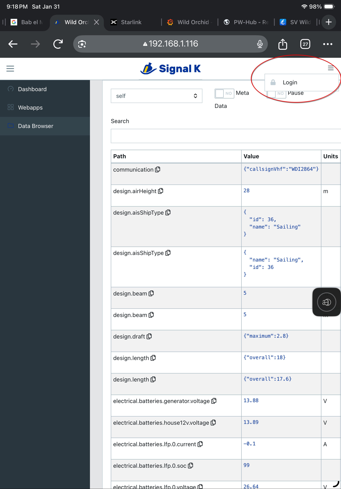
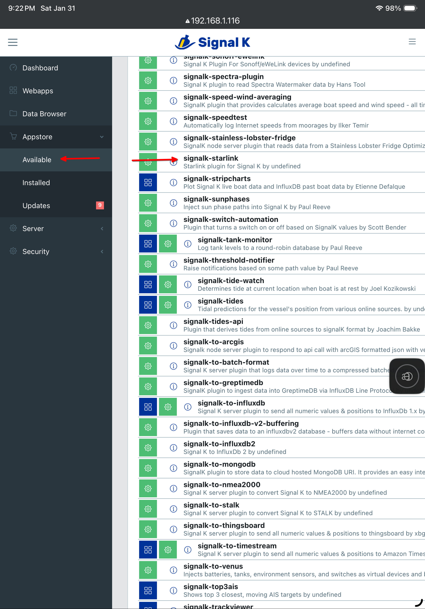
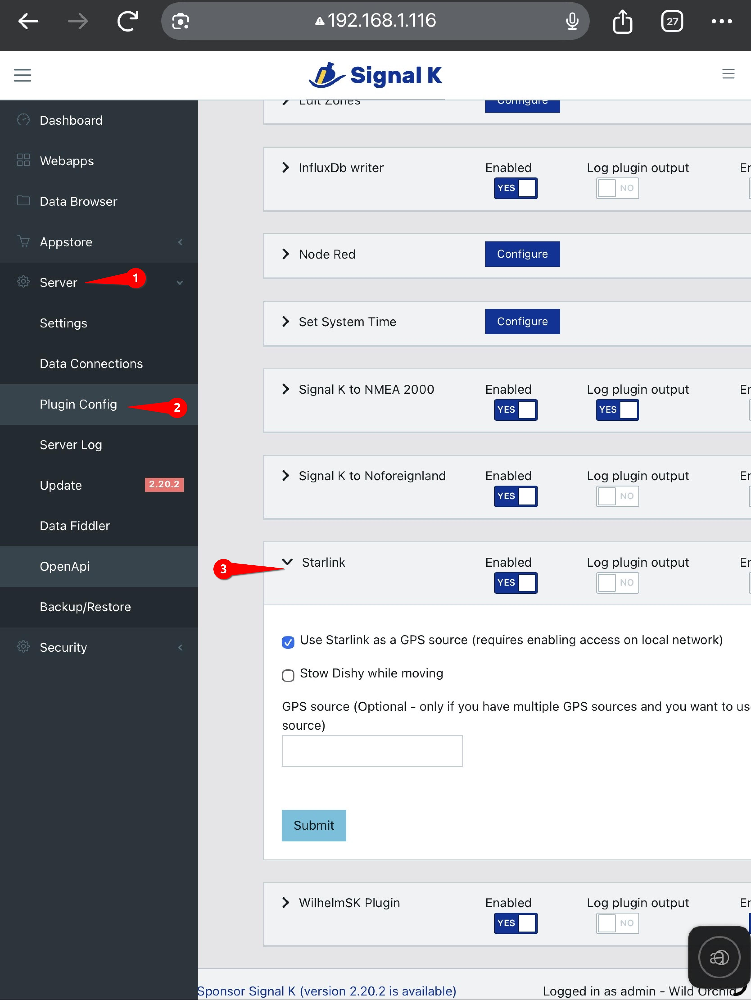
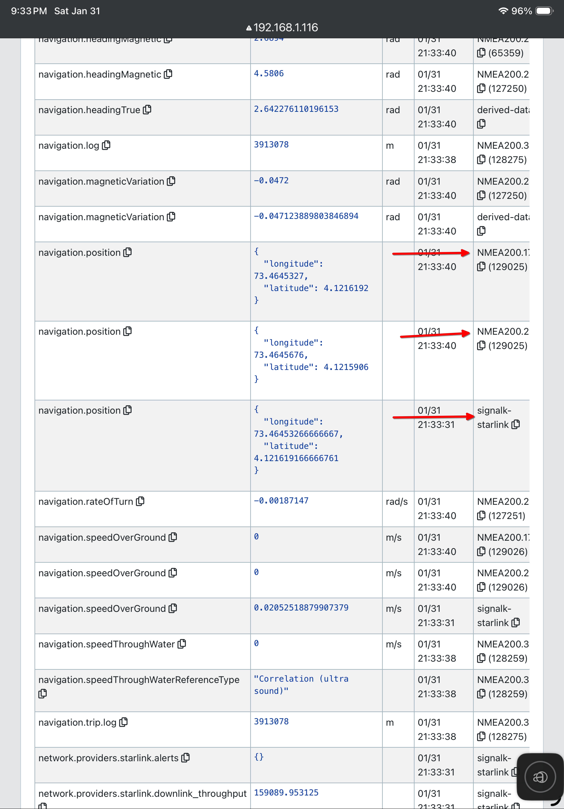

# GPS Loss Alerting Setup

Compared to the other capabilities in this repo, GPS loss alerting is more complex.
You need to set up signalk. Then you should be prepared to run python programs,
and configure parameters that enable sending alerts to internet messaging services.

## Overview

GPS Loss Alerting is accomplished by two python programs:

1. diff_starlink_gps.py detects position deviations (spoofing) and loss
of position data (jamming). It writes alerts to a file, including
return-to-normal alerts.
2. starlink_gps_alert.py sends error-alerts and returned-to-normal
status as emails and Telegram messages.

diff_starlink_gps.py relies on signalk being set up to publish Starlink position
and GPS data. In turn, this requires you to have set up Starlink to publish
position data.

The programs come with .service files which allow them to run as
services that start automatically upon boot and run in the background
on an Ubuntu linux system. If you have a Raspberry Pi, you could set
it up as a server and run these programs on it.

First, we describe how to set up signalk. Then we go on to set up diff_starlink_gps.py
and starlink_gps_alert.py and its configuration file.

### Extensibility

The alerting system has been designed to be extensible to other alerting
technologies besides email and Telegram messages. The system comprises:

1. A fault detection program, which appends alerts to a file
2. A file change detection program, which writes the alert file to
the alert messaging channels then clears the file.

You can extend the system to other notification techniques by monitoring
the alert file: $HOME/logs/starlink_gps_alerts.txt. Anytime the file
changes, it means there's an alert to be sent, and the file contains
the timestamp and description for the alert. If you have some other
program that can monitor that file and do your favorite thing, feel free
to use it in place of starlink_gps_alert.py.

## Signalk configuration

Note: signalk standard/default convention is to have 192.168.1.xxx:3000 as
the path to control/view signalk. Port 3000 was already taken on my server
with a grafana page, so I changed the default to port 80 for my signalk.

To add the signalk-starlink plugin to your signalk, login to signalk
(top right, three horizontal lines) 

then click on Appstore, then **Available**

You will find the plugin here.

The next step is to configure the signalk-starlink plugin by going to
Server, then Plugin Config, and look for Starlink

You will want to enable it, then check the option for "Use Starlink as a GPS
source (requires enabling starlink access on local network
as previously described)." 

Restart signalk, and then using the Data Browser for siganlk, look for the path 
navigation.position.  You probably have multiple of these, but one should have 
signalk-starlink in the far right Source column. Note the path for
the other "navigation.position" source that you want to use to
compare against stalink position.


## Install GPS_loss_alerting software

All the following steps must be done on the computer (Windows or Linux)
that you are going to run the Loss-Alerting software on.

### Prerequisites

- signalk with the Starlink plugin running on a Windows or Linux
server that's on your network
- python installed (a quick google search should help you install it)
- location access on the Starlink antenna has been enabled by
following the steps on [this page](https://maddox-zephyr.github.io/starlink_position/starlink_setup.html)

### Download the zip file of this repo

- Send your browser to the [URL to download the repo zip file](https://github.com/Maddox-zephyr/starlink_position/releases)
- Under the most recent release, expand the Assets dropdown arrow.
- Click on the source code .zip file to
download the zip file to your computer
- Optionally move the file to any place you want on your computer
- Unzip the file. It will create a folder with a name like starlink_position-0.1

### Install dependencies

- Open up a shell or command window and cd into the GPS_loss_alerting
subdirectory and install dependencies. For example:
```
cd starlink_position-0.2/GPS_loss_alerting
```
- Install the dependencies by running the following command:
```
python -m pip install -r requirements.txt
```
**Note:** if you are installing on Ubuntu 24.04 or later you might want to
create and activate a virtual environment. Google for instructions on that.

### Configure alert destinations

The alerting program, starlink_gps_alert.py sends alerts via gmail to
any email address, and also sends alerts via Telegram to any configured
Telegram app. Configuration is done in a file, "alerting_secrets.py",
which you create by copying alerting_secrets_template.py.

You can drop one or the other of email and Telegram alerts
by setting the gmail_alert_enabled or telegram_alert_enabled variables in
the alerting_secrets.py files to False.

#### Configure gmail alerts

Copy the file alerting_secrets_template.py to alerting_secrets.py. This file
will contain your passwords and secrets - never make it public.
Open alerting_secrets.py in a text editor.

1. Change the "subject" string to an appropriate email subject line for alerts about
your boat.
2. Edit the receivers line to contain a list of the email address(es) you want alerts to be
sent to. You can have one or more email destinations for alerts.
3. Create a new gmail account to be used to send email alerts. For example, you
could create an account called your_boatname.alerts@gmail.com.
4. Edit the username line in alerting_secrets.py to contain the new gmail address.
This is the address that email alerts will come from.
5. Generate an app key for the new Gmail account. This is the password
that starlink_gps_alert.py will use when sending email alerts. To
generate an app key (app password) for Gmail, you must first enable
2-Step Verification on the new Google Account. Once active, go to
the new Google Account settings, navigate to Security, and select "App
passwords" under "Signing in to Google". Create a name for the app (e.g.,
"starlink_gps_alerts"), click "Create," and copy the 16-character password
provided into the password line in alerting_secrets.py.
6. Save alerting_secrets.py.

#### Configure Telegram alerts

Telegram is a messaging service that's like WhatsApp. It has an associated
phone app which will receive the alerts.

Using Telegram alerts involves creating a bot in Telegram which
starlink_gps_alert.py sends alerts to. The bot passes the alerts
along to the Telegram app installed on your phone.

Install the Telegram app on your phone and create a Telegram account
if you don't have one.

Google "I want to set up a telegram bot to receive messages sent to it and
send them on to the telegram app on my phone. I am sending the messages
from a python script which posts a BOT_ID and CHAT_ID and message to
the bot." Follow the AI instructions which cover how to create the bot
and establish communications between it and the Telegram app on your phone.

Out of this process you will obtain a BOT_TOKEN and a CHAT_ID. Edit
alert_secrets.py and enter the BOT_TOKEN and CHAT_ID into the
appropriate places in that file. You can have one or more bots - one
for each Telegram user who is to receive alerts. Delete any unused
entry in the alert_secrets.py file.

## Run diff_starlink_gps.py

In a command window or shell, run:
```
python diff_starlink_gps.py
```
It should display something like:
```
2026-02-04 03:43:12,037 - INFO - GpsAlerter initialized.
2026-02-04 03:43:12,038 - INFO - Starting GPS Alerter...
2026-02-04 03:43:12,067 - INFO - Connected to Signal K websocket at ws://192.168.1.116:80/signalk/v1/stream?subscribe=none
2026-02-04 03:43:12,067 - INFO - Subscribed to navigation.position updates.
2026-02-04 03:43:14,900 - INFO - Starlink Position: 4° 7.298' N, 73° 27.873' E. GPS delta: 0.004 NM (max: 0.004 NM)
2026-02-04 03:44:29,911 - INFO - Starlink Position: 4° 7.298' N, 73° 27.873' E. GPS delta: 0.004 NM (max: 0.004 NM)
2026-02-04 03:45:44,893 - INFO - Starlink Position: 4° 7.298' N, 73° 27.873' E. GPS delta: 0.004 NM (max: 0.004 NM)
```
Observe the delta-distance between
the location provided by Starlink and that provided by GPS.
In a normal environment, the GPS delta should be a small fraction of a mile.

The program writes logs to a file: $HOME/logs/starlink_gps_logs.txt, and you
can look at the history of position readings and current and max difference
between Starlink and GPS.

The program writes alerts to a file: $HOME/logs/starlink_gps_alerts.txt,
from where they may be read and removed by the alerting program: starlink_gps_alert.py

### Self-test mode

You can also start diff_starlink_gps.py in self-test mode by running it with the -t option. This is useful for testing that the alerting process is working correctly.
```
python diff_starlink_gps.py -t
```
In self-test mode, it simulates all the faults it can detect and sends alerts,
spaced a few minutes apart, for each one. After it has simulated all the
faults it returns to normal operation, checking for real faults. If you
have configured sending alerts properly you should see an alert for each
simulated fault.

## Run starlink_gps_alert.py
In a command window or shell, run:
```
python starlink_gps_alert.py
```
You should receive an email and a Telegram message with a startup message
from the app.

## Install the python apps to run as a service

Different OS's and versions deal with services differently. For Ubuntu 22.04
you should copy diff_starlink_gps.service and starlink_gps_alert.service
to /etc/systemd/system, then run the following commands to activate the services.
```
sudo systemctl daemon reload
sudo systemctl enable starlink_gps_alert
sudo systemctl start starlink_gps_alert
sudo systemctl enable diff_starlink_gps
sudo systemctl start diff_starlink_gps
```
Use Google to tell you how to configure services on other OS's or versions.

## Finally...
**Wait for an message saying GPS is wrong. Check logs to confirm. Switch
to alternate navigation. Sail on happily with good position. :-)**
