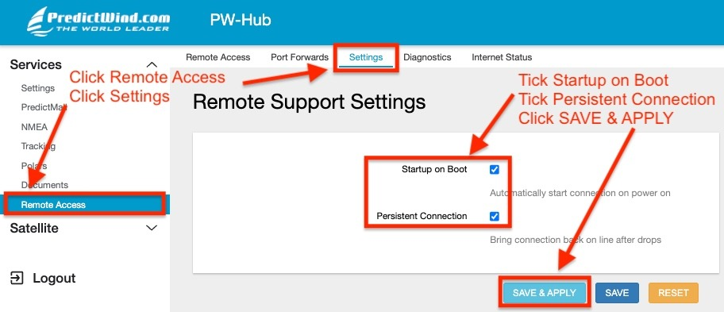
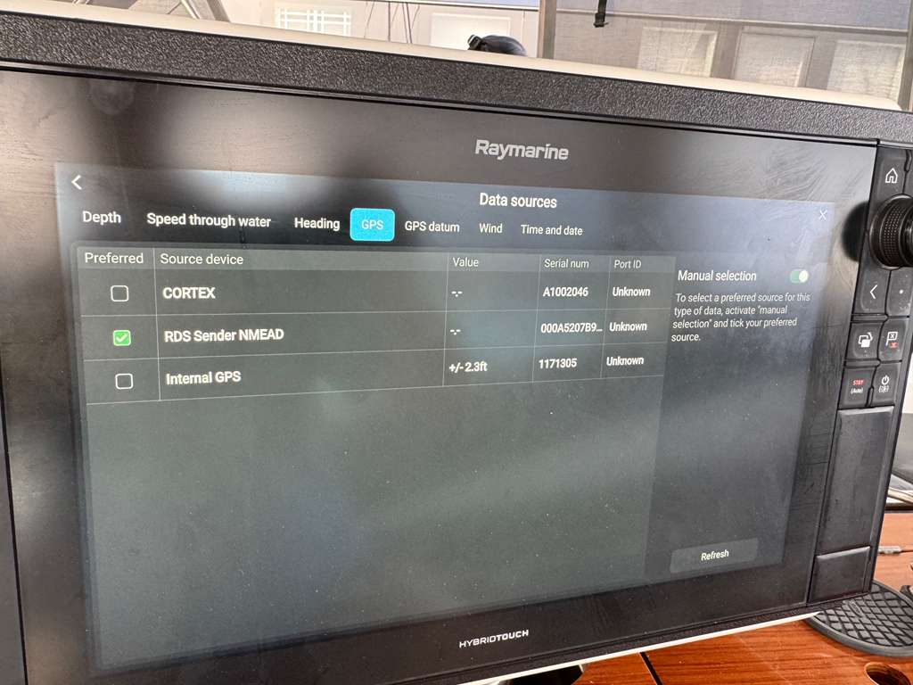
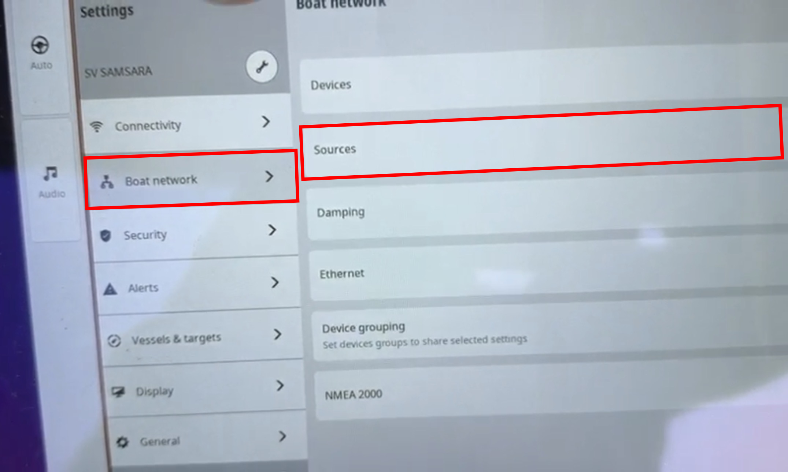
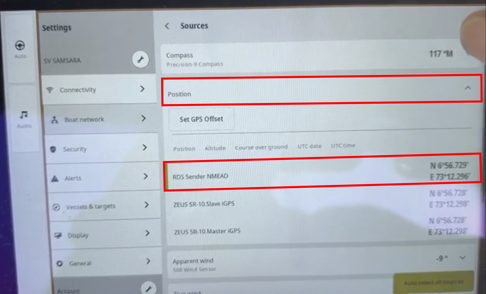
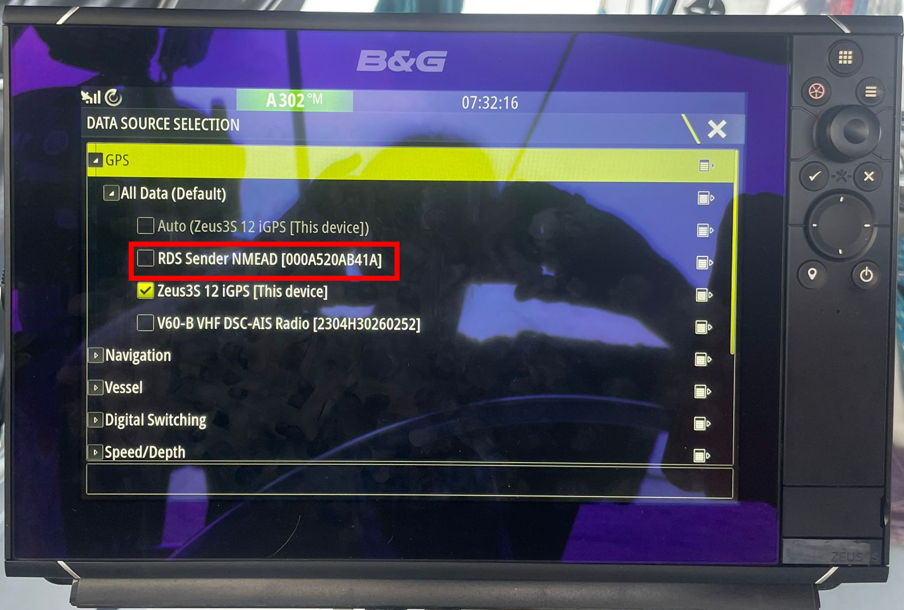
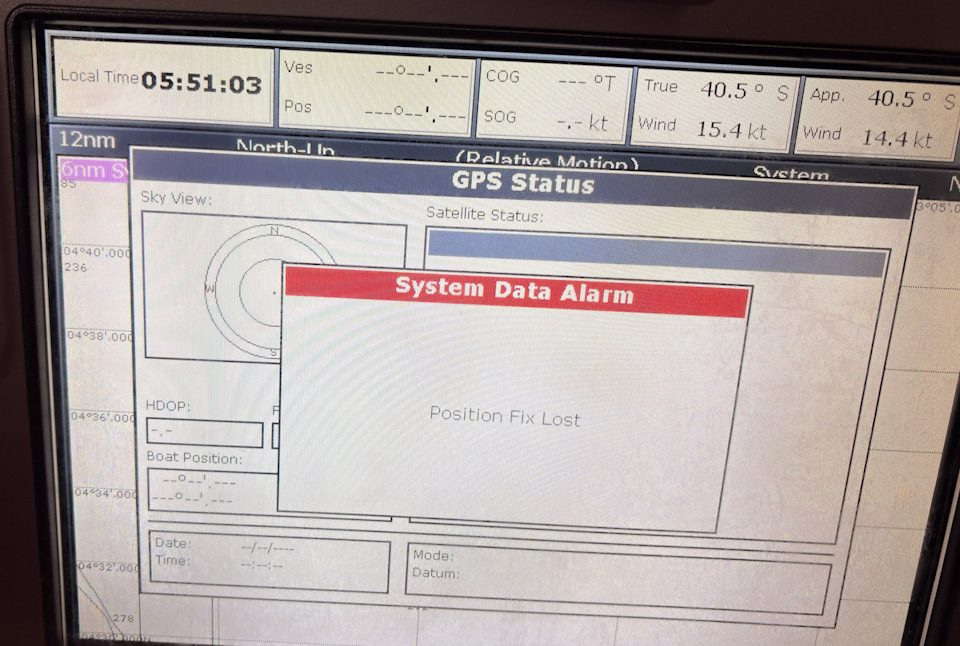
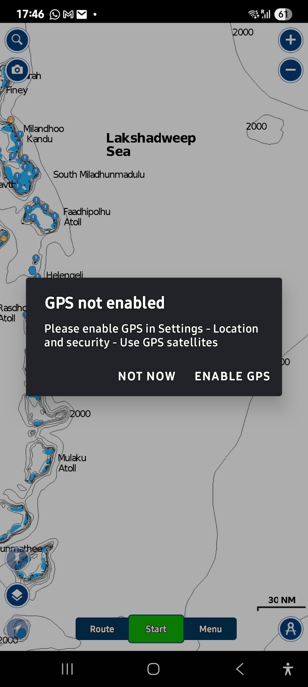
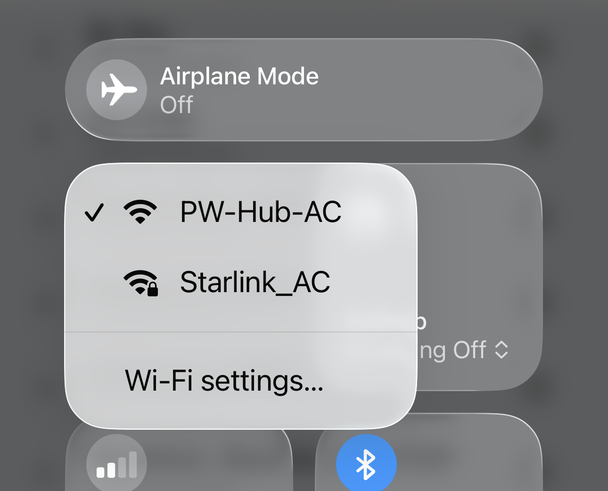
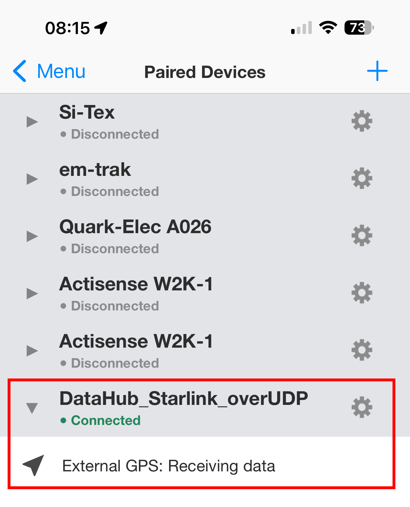

# PredictWind DataHub → Chartplotter / OpenCPN / Navionics Setup (Starlink Positioning)

This document describes how to use **Starlink position data** via the **PredictWind DataHub**
as an alternative navigation position source when GNSS is unavailable, degraded, or spoofed.

The DataHub converts Starlink position data into standard **NMEA 0183** and **NMEA 2000**
messages, making them usable by:

- Chartplotters (Raymarine, etc.)
- OpenCPN
- Navionics (mobile)
- Other NMEA-capable navigation software

> ⚠️ **Important disclaimer**  
> Starlink positioning and DataHub-derived GPS data are **not certified as primary navigation sources**.
> This setup is intended as a **fallback / resilience option** only.
> Always cross-check position data and revert to certified GNSS sources as soon as possible.
> PredictWind provides no warranty or guarantee for the reliability and accuracy of any GPS position data supplied from Starlink.
>
> ⚠️ **Other Important Notes**
> The DataHub cannot accommodate this feature in the firmware due to its large file size.
> PredictWind is offering this upgrade via a manual workaround that relies on the Datahub's internal SD card, and as such is not a long-term solution.
> We have done this to provide immediate support to Red Sea cruisers in the interests of the safety of our customers.
> 
> This is a limited-time offer available to Red Sea Cruisers until **April 1, 2026**
> 
> The best solution is to [buy a DataHub Pro](https://shop.predictwind.com/shop/product/datahub-pro-unit) to continue to use Starlink GPS long term. 

---

## 1. Overview – Data Flow Options

The PredictWind DataHub can distribute Starlink position data in **two parallel ways**:

### 1.1 Over Wi-Fi (NMEA 0183)
- UDP (recommended for most apps)
- TCP (supported by some apps)
- Used by:
  - OpenCPN
  - Navionics
  - Other mobile or desktop apps

### 1.2 Over the Navigation Backbone (NMEA 2000)
- DataHub → **NMEA2000**
- Can be bridged to:
  - **SeatalkNG**
  - **Seatalk1** (via Raymarine converters)
- Used by:
  - Chartplotters (MFDs)
  - Autopilots
  - Instruments

Both methods can be active simultaneously.

---

## 2. Pre-Requisites

- PredictWind **DataHub** (Pro model required)
- PredictWind **Professional subscription**
- Starlink (Mini tested, other generations expected to behave similarly)
- Starlink configured to expose position data on the **local network** and to **use Startlink positioning exclusively**
  - See: [Starlink setup](starlink_setup.md) for details

---

## 3. DataHub Firmware Update (Required)

Starlink positioning support requires **DataHub firmware v4.43 (beta)**.

### Steps
1. Login to the DataHub web interface
2. Navigate to: **Services → Settings → Software Update**
3. Select **Alternate**
4. Upgrade to **v4.43** (**Important Note:** This is the **only** version of DataHub Firmware with SLGPS capability)

You should see in the changelog: 
  "Starlink infrastructure"

  > ℹ️ This feature is available only to **PredictWind Pro users**.
  > DataHub Pro hardware is required due to increased memory and CPU usage.
> 
  > ⚠️ Once manually enabled, if your DataHub SD card is ever wiped, or when your Datahub firmware is upgraded, **your DataHub will lose this feature**.
  > The best solution is to [buy a DataHub Pro](https://shop.predictwind.com/shop/product/datahub-pro-unit) to continue to use Starlink GPS long term. 

(DataHub alternate download)

---

## 4. Enable Remote Access

Remote Access is required by PredictWind to manually enable Startlink GPS

### Steps
1. Login to the DataHub web interface
2. Navigate to: **Services → Remote Access → Tools**
3. Tick **Startup on Boot** and **Persistent Connection**
   

5. Click **SAVE & APPLY**
6. Navigate to: **Services → Remote Access**
7. On the webform for Remote Support, add your **Boat Name**, **Your Name** and your **Email**
8. In the **Additional Info** field, add "Please Enable SLGPS"
9. Click **ENABLE REMOTE SUPPORT**

Within 24/48 hours, PredictWind Support will connect to your unit and apply the manual workaround and be in contact with you directly.

---

## 5. Enable Starlink GPS in DataHub

After updating:
1. Go to: **Internet → Starlink**
2. Enable **GPS via Starlink**
3. Click **Save & Apply**

(Make/Model: PredictWind DataHub, firmware v4.43)

4. Then go to: **NMEA → Source**
5. Select **Position via Starlink**
6. Click **Save & Apply**

 ℹ️ In future, if you wish to revert to regular GPS, update **NMEA → Source** back to your preferred option, e.g. NMEA2000 on CAN0, then click Save & Apply. 
 
 ℹ️ If you are not using SLGPS for an extended period, it may be wise to disable it under **Internet > Starlink** to reduce DataHub CPU usage.

(Make/Model: PredictWind DataHub, firmware v4.43)

---

## 6. Advanced Starlink GPS Tuning (New)

Recent DataHub updates introduce **advanced tuning options**:

### 6.1 Poll Rate
- Range: 2–10 seconds
- Controls how often the DataHub queries the Starlink dish
- Lower = more responsive, higher CPU/network usage

### 6.2 Window Size
- Number of samples used to compute averages
- Affects COG/SOG stability
- Larger values = smoother output, more lag

### 6.3 Smoothing Factor
- Range: 0.0 – 1.0
- Exponential smoothing applied to track output
- Lower = smoother, but increased latency (1 = no smoothing; 0.3 = 70% smoothing)

**Recommended starting values:**
- Poll Rate: `3`
- Window Size: `5`
- Smoothing Factor: `0.3`

> ⚠️ Excessive smoothing may delay turns and course changes.

(Make/Model: PredictWind DataHub)

---

## 7. Chartplotter Configuration

### 7.1 Modern Chartplotters (GPS Source Selection)

Some MFDs (e.g. Raymarine Axiom series, and B&G Zeus Series) allow manual GPS source selection.

### 7.1.1 Raymarine Axiom Series
**Select:** GPS Source → DataHub (RDSensing)

(Make/Model: Raymarine Axiom Pro)

---

### 7.1.2 B&G Zeus SR-10
**Select:**
  1. Settings
  2. Boat Network
  3. Source
  4. Position
  5. There should be a new option showing: **"RDS Sender NMEAD**

(Make/Model: B&G ZEUS SR-10)

(Make/Model: B&G ZEUS SR-10)

(Make/Model: B&G ZEUS SR-10)

---

### 7.1.3 B&G Zeus 3
**Select:**
  1. Settings
  2. Network
  3. Sources
  4. Advanced
  5. GPS
  6. There should be a new option showing: **"RDS Sender NMEAD**

(Make/Model: B&G ZEUS 3)

### 7.2 Legacy Chartplotters (No GPS Source Selection)

Older chartplotters (e.g. **Raymarine E120 Classic**) do **not** allow GPS source selection.

In this case:
- All other GPS sources **must be disconnected or disabled**
- This includes:
  - Internal GPS
  - AIS GPS feed
  - External GPS sensors

The chartplotter will then automatically use the **only available source**: DataHub → Starlink.

#### Example: GPS lost before enabling DataHub

(Make/Model: Raymarine E120 Wide Classic)

#### Example: Fix restored via DataHub / Starlink

(Make/Model: Raymarine E120 Wide Classic)

---

## 8. DataHub → Navigation Backbone (NMEA2000 / Seatalk)

When connected to the navigation backbone, the DataHub injects GNSS data into:

- NMEA2000
- SeatalkNG
- Seatalk1 (via converter)

This allows **full system integration**, including:
- Chartplotters
- Autopilots
- Wind instruments
- Log / speed calculations

---

## 9. Navionics Configuration ( (Step-by-Step)

### 8.1 Disable Internal GPS / disable phone **Location Services**

This ensures Navionics uses **only Starlink-derived position data**.

---
 
### 9.2 Your Navionics shouls give you a warning **GPS not enabled**. We are now ready to pair our Datahub as the new GPS source

---

### 9.3 Connect device to **DataHub Wi-Fi** 
**Not** the Starlink Wi-Fi

---

### 9.4 Pair the DataHub GPS source: Go to:  Menu → Paired Devices

---

### 9.5 Click the '+' to pair a new device and then click on 'Add Device"

---

### 9.6 Setup the new device as:
  - Name: DataHub_Starlink_over UDP (example - free field)
  - Host: 0.0.0.0
  - Port Number: 11101 
  - Protocol : **UDP** (recommended)

  OR
  - Name: DataHub_Starlink_over TCP (example - free field)
  - Host: 10.10.10.1
  - Port Number: 11102
  - Protocol : **TCP** (alternative)

---

### 9.7. Click **SAVE**
  You should now be able to see the new active device receiving GPS positions from the paired Datahub:

---
   
### 9.8 You are now ready to navigate using Navionics using Starlink Positioning over Datahub

---

### Remarks:
- Navionics **cannot disable a paired device**
- An active connection **cannot be forgotten**
- You must break the connection (disable Wi-Fi or switch off DataHub) to remove it

---

## 10. OpenCPN Configuration (Step-by-Step)

### 10.1 Disable Internal GPS

- Uncheck **Built-in GPS** in OpenCPN  
  **OR**
- Disable phone/tablet **Location Services** (see item **8.1**)

This ensures OpenCPN uses **only Starlink-derived position data**.

---

### 10.2 Network Setup
- Ensure your device is connected to the **DataHub Wi-Fi**
- **Not** the Starlink Wi-Fi

---

### 10.3 Add Network Connection

1. Open OpenCPN
2. Go to: Options → Connections
3. Add a new connection:
  - Protocol: **UDP** (recommended)
  - Address: 0.0.0.0
  - Port: `11101`
  - Input only
  - Enable

  OR
  - Protocol: **TCP** (alternative)
  - Address: 10.10.10.1
  - Port: `11102`
  - Input only
  - Enable

---

### 10.4 Go to Settings → Connections and make sure you are only selecting Datahub as the GPS source (UDP or TCP)

---

### 10.5 You are now ready to navigate using OpenCPN with Startlink Positionig over Datahub

---

## 11. Technical Details – NMEA Sentences & PGNs

### 11.1 NMEA 0183 (Wi-Fi – UDP/TCP)

The DataHub outputs:
- `RMC` – Recommended Minimum Navigation Data
- `GGA` – Fix data
- `GLL` – Geographic position
- 'GSA' - Satellite Quality and Signal Dilution of Precision
- 'GSV' - Number of Satellites in View
- 'PSTAR' - Starlink Status Information (Online / Offline / Estimate vs Actual Position)

These are consumed by:
- OpenCPN
- Navionics
- Mobile navigation apps

Update rate:
- Internal dish polling: configurable (2–10s)
- Output rate: **1 Hz**
- Intermediate values use **dead-reckoning interpolation**

---

### 11.2 NMEA 2000 PGNs (Backbone)

The following PGNs are transmitted:

| PGN     | Description |
|--------:|-------------|
| 129029  | GNSS Position Data |
| 129025  | Position, Rapid Update |
| 129026  | COG & SOG, Rapid Update |
| 129033  | Local Time Offset |
| 126992  | System Time |

> **Note:** PGN 129033 is particularly useful for **older Raymarine systems**
> that rely on network-provided time information.

---

## 12. Operational Notes & Best Practices

- Use **Starlink Positioning Exclusively** in the Starlink app when GPS spoofing is suspected
- Always compare position with:
  - Radar
  - Visual fixes
  - Depth contours
- Switch back to certified GNSS when stable

---

## 13. Summary

This setup provides a **robust, multi-path fallback navigation solution** using:

- Starlink positioning
- PredictWind DataHub
- Standard NMEA interfaces

It has been tested on:
- Modern and legacy chartplotters
- OpenCPN
- Navionics mobile apps

While not a replacement for certified GNSS, it significantly improves
navigation resilience in GPS-challenged environments.

---

