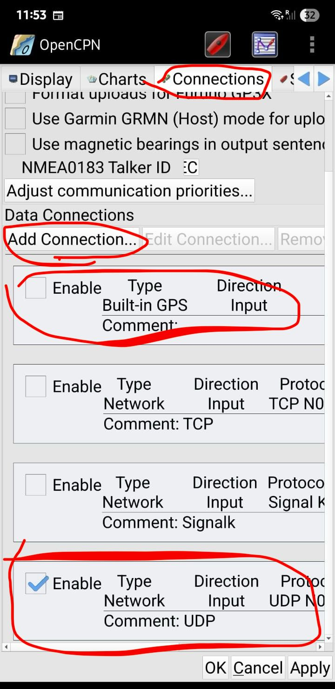
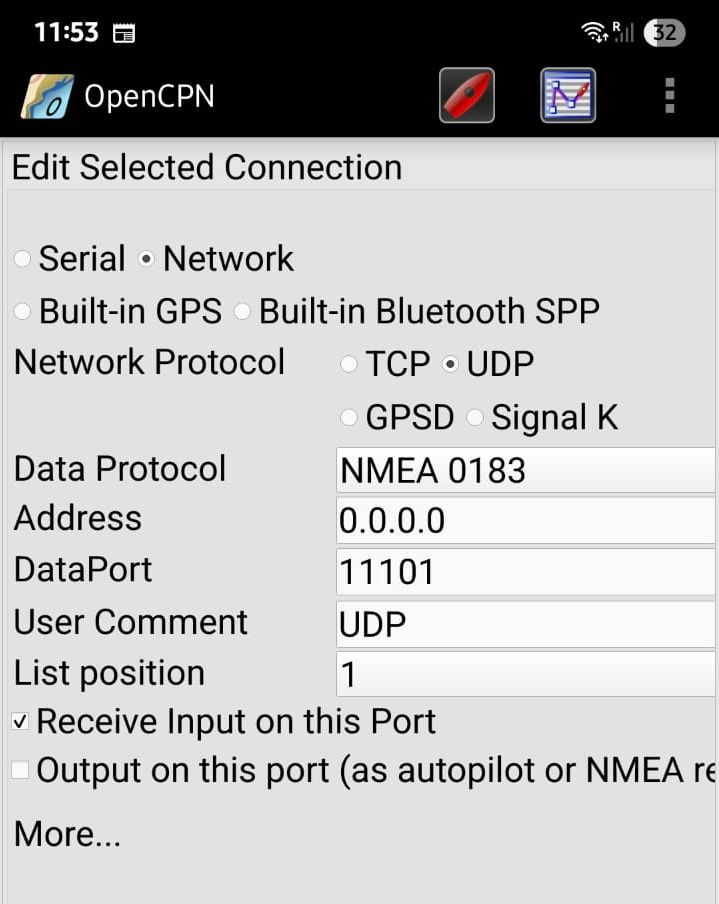

# PredictWind Datahub and Chartplotter / OpenCPN setup

Using PredictWind's Datahub with Starlink involves installing a Datahub
plugin that forwards Starlink's location data as NMEA data that can
be consumed by Raymarine chart plotters or OpenCPN.

Here is a step by step guide for configuring the
Starlink->PW Datahub->Chartplotter configuration.

### Pre-requisites

- You have a PredictWind Datahub
- You have configured Starlink to make its location available on the local network

# Update Datahub

You will need to update the firmware on your Datahub. Login and navigate to services->settings->software update. Push the alternate button.. select version 4.41. this is a pre-release version of the software that has support for Starlink GPS (SLGPS). You will see something like:

```
version 4.41
- Starlink infrastructure
```
in the change log. 

Once the upgrade completes login to the unit and navigate to 
internet->starlink.

You should see an option for enabling Starlink position.
Enable the option and then hit save & apply...

After the page refreshes you will see two new tabs under
internet->starlink. They contain:
1. The current position obtained from the dish.
2. Dish status information.

You should now see RMC, GLL, and GGA NMEA183 sentences out of the Datahub. You
can use these for navigating your boat with Aquamap, navionics, openCPN,
etc.

You should also see PGN 129029 (GNSS) on the N2K bus. You should be able
to select DataHub (RDSensing) as the GPS source for GPS on your MFD.

Note that Datahub polls the dish for position and status info once every 10
seconds. It sends out NMEA updates once per second. The updates used
interpolated data (dr) and times between samples. So this should allow
for smooth updates on your nav equipment. COG and SOG are computed for
RMC using adjacent sample points.

Finally note that this feature is not slated for general release for
DataHub users. It will only be available for DataHub Pro users. The reason
for this is that the software will not fit in flash. Datahub Pro has a lot
more resources (and is much faster) so not an issue on the new platform.

**Note from Datahub developer:** I had to copy the Dishy GRPC support software onto the SD card
on your unit. I can do same for other users in your group. The procedure
for these other users is for them to update to v4.41 using the procedure
above and then send an email to support@predictwind.com requesting
that SLGPS be enabled.

## Configure Chartplotter

The image below shows the Raymarine Axiom Pro GPS source selection screen,
with Starlink selected for GPS data via the Datahub.


The older Raymarine E120 chartplotter tested by Rui does not have a source
selection screen - it assumes there is only one source. It is necessary to
disable (turn off) other GPS sources, like the Chartplotter's GPS and AIS.

## Configure OpenCPN

The images below show selecting Starlink GPS data in OpenCPN.


