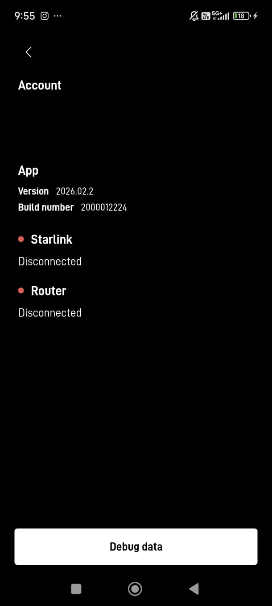
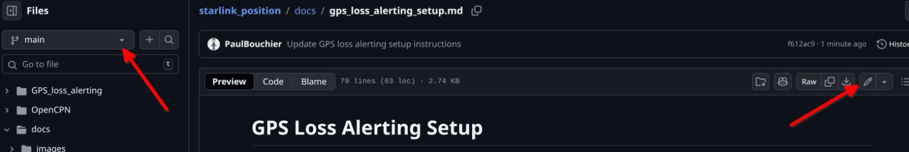

# Repo Maintainer Instructions

This section is for repo maintainers

# The starlink_position repo

## Overview of repo structure

The repo has a folder for each major project that delivers code or files, and
a docs folder that contains markdown files with documentation delivered
by the gh-pages website. Under the docs folder is an images folder containing
the images used by the various pages. 

## gh-pages (GitHub Pages)

This repo is configured to publish the markdown files in the docs folder
as a set of html pages rooted at https://maddox-zephyr.github.io/starlink_position/. It uses a GitHub capability called GitHub Pages (or gh-pages). Whenever someone commits a change to the **main** branch of the
repo. the website is regenerated from the .md markdown files in 
the docs directory
(and any referenced images), and the markdown (.md files) are converted
to html files, for use by a browser.

The landing page is index.md, and it contains links to the other pages. The
links reference the html files, which will be the product of .md files. For
example, index.md contains the following:

```
See the [repo maintainer instructions](repo_maintainer_instructions.html) for...
```
The text in square brackets:
"repo maintainer instructions" is the text of the hyperlink, and the
hyperlink itself is "repo_maintainer_instructions.html" in the current
directory. repo_maintainer_instructions.html is
autogenerated from repo_maintainer_instructions.md - this
file in the repo.

The job of maintainers is to create & update markdown (.md) files, as well
as any necessary software. These markdown files specify formatting and
links and images for when the files get transformed into html pages
on the website.

## Markdown

In a markdown file, you use special text syntax to tell how to format
your page. You can google markdown format to get the common features
that format text, but here's a quick reference:

### Headings
```
# Heading level 1 - makes a level 1 heading
## Heading level 2 - likewise
### Heading level 3 - likewise, and so forth, for some number of levels
```

### Formatting

Surround text with **double asterisks** to bold it, or *single asterisks* to
italicize it.

### Lists

A '-' in the first position of a line introduces a bullet into a bulleted list.
A number then period introduces a numbered item into a numbered list
```
- first item in bulleted list
- second item in bulleted list

1. first item in numbered list
2. second item in numbered list
```
### Hyperlinks

You can link to external web pages, or to pages generated from this repo.
The form is:

```
[text to display as link](hyperlink_to_web_page)
```
hyperlink_to_web_page can be an external page like https://google.com,
or a local page like repo_maintainer_instructions.html. Note the .html
extension; the hyperlink must refer to the html page that is generated
by gh-pages from the corresponding .md file.

### Images

Put images in the images folder. Refer to them like this:

```

```
The text you put in square brackets doesn't matter, but the hyperlink
in parentheses needs to be the image filename relative to the docs directory.

# GitHub repos

GitHub contains the master copy of this repo in the cloud,
including its entire history.
Maintainers can make changes to the master copy in one of three ways:

1. Quick and Dirty: Directly edit a file on the GitHub repo web page
2. Best Practice: Edit a local copy on a branch, merge the branch to main,
then push your updated main to the master copy in the cloud.
3. Bespoke workflow for starlink_position

There are several collaborators on this project, and some way of allowing
each of us to work independently, yet not step on each other's toes is needed.
This is the purpose of the Best Practice workflow.

The **Quick & Dirty** workflow is adequate if you're making a minor change
to a file that you expect you're the only one working on. You directly change
the repo in the cloud. It is simple, but can fail if someone else
makes a change between when you start editing and when you want to
commit your changes.

The **Best Practice** workflow is best when you are going to be working
on a line of development for some time, during which others may make
changes in the repo. It is more complicated, involving local and cloud
repos and getting changes synced between the two.

The **Bespoke Workflow for starlink_position** hasn't been agreed among
the developers, but we can probably some up with a lighter-weight process
that protects maintainers from stepping on each other's toes.

## Git + GitHub concepts and terminology

### Git

Git is version control software - it tracks changes in files and folders
under a root project folder. It enables switching between different states
of the files and folders. Changes are recorded as differences in files
and folders between different **commits**. A commit is when you tell git
you want to record the current state of the files and folders (typically when
you reach some natural stopping point). Git saves the changes from the last
commit. A commit can be thought of as a checkpoint.

Git supports the notion of "branches". A branch is a string of commits
off of some point in the project's history. They are used to avoid multiple
collaborators stepping on each others toes as they potentially change the
same files/folders. The main branch is called "main", and there is a
paul_work, bruce_work, and a rui_work branch that you can use. You can
also make your own branches.

Maintainers use git client software to manipulate their local copy and to
interact with the master copy in the cloud.

### GitHub

GitHub is a website that hosts the "master copy" of the
repo in the cloud.

In the *Quick & Dirty* workflow, maintainers edit
files in the master copy directly using the GitHub website.

In the *Best Practice*
workflow, maintainers get a copy of the repo by **cloning**
it into a local folder. Maintainers then **commit** changes to
their work-branch in their local copy. When ready to push
changes to the cloud, maintainers **pull** any updates from the cloud,
then merge their work-branch to the *main* branch then **push** *main*
to the master copy in the cloud. Other
maintainers **pull** the latest changes to *main* down from the cloud into their
local repo copy, where they are (usually) merged automatically. Cruising
skippers probably don't want to become git experts, and this process,
which is used by software development teams, is probably too complex
and heavyweight.

The *Bespoke workflow for starlink_position* is TBD

# Quick & Dirty workflow

Open the repo in GitHub and navigate to the file you want to edit.
For example, navigate to https://github.com/Maddox-zephyr/starlink_position/blob/main/docs/starlink_setup.md on the main branch. See the screenshot below.
. 

The right red arrow points to the edit button. When you press it
you get an editing web page that allows you to directly edit the
file. You will have a green **commit** button on the top right of
the editor screen. When you're done editing, press the commit button
and you'll have the opportunity to change the auto-generated commit
message, then the change will be committed. If you edited the main
branch, the website will immediately be updated and you can reload
and check your work in another browser tab.

The left red arrow points to the branch selector drop-down. You can select
to edit on the main branch, or on your work-branch, like rui_work. If you
edit on the main branch, there is some danger that another maintainer may
edit and commit a change to the file you're working on. If that happens,
you'll get an error when you try to commit your change, and you may need
to reapply your edits, so save them away somewhere.

# Bespoke workflow for starlink_position

TBD