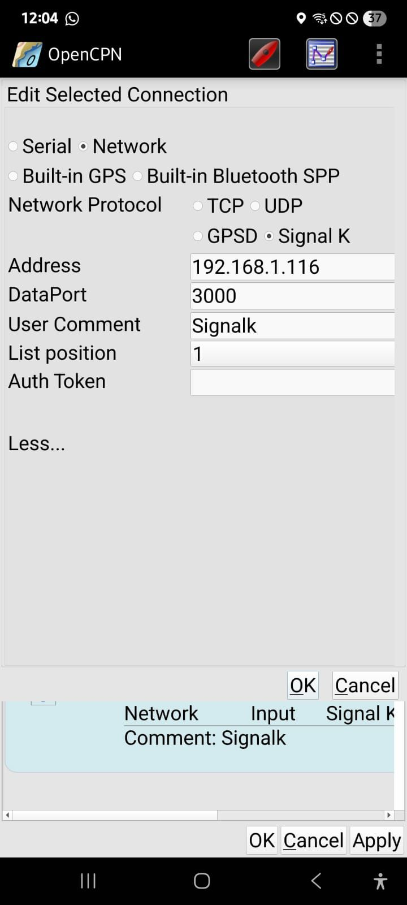

# Signalk to OpenCPN setup

## Pre-requisits

- You should have signalk running on a server somewhere on your network

## Signalk configuration

Add the Starlink plugin into Signalk and configure Signalk to pull location
data from Starlink, and to output it.

**TODO: how to do all this**

OpenCPN already has a configuration option to read from Signalk.
See )
