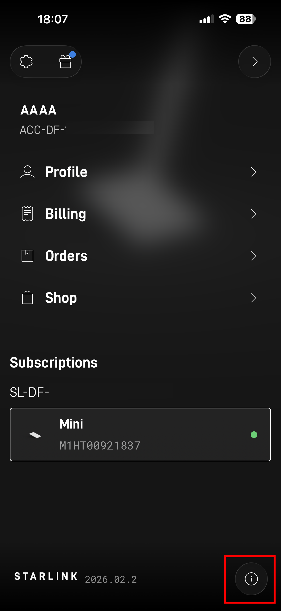
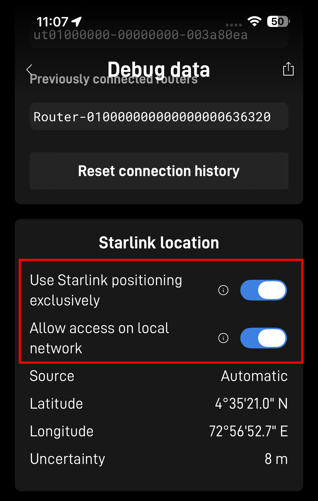
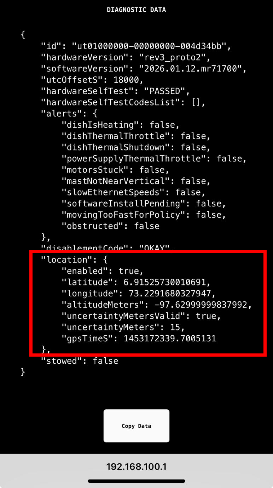

# Starlink Setup – Enabling Location Data on the Local Network

All solutions described in this repository rely on the **Starlink antenna making its position data available on the local network**.
This configuration is performed using the official **Starlink mobile app** and is required whether you are using:
  - PredictWind DataHub
  - SignalK
  - OpenCPN (direct or indirect)
  - Custom scripts consuming Starlink location data

---

## Accessing the Location Settings in the Starlink App

1. Open the **Starlink mobile app**
2. On the main screen, tap the **menu icon with two horizontal lines** (top-left)
3. Scroll to the bottom of the page and tap the **“i” (information)** icon
4. Scroll down and select **Debug Data**
5. Scroll to the **Starlink location** section
6. Enable both options: **Use Startlink positioning exclusively** and **Allow access on local network**

---

## Required Configuration Options

In the **Starlink location** section there are **two independent options**. Both are important, but they serve **different purposes**.
 
---

### 1. Allow Access on Local Network (REQUIRED)
  
- **This option must be enabled** for all configurations in this repository
- It allows onboard systems (PredictWind DataHub, SignalK server, laptops, etc.) to access Starlink location data over the local network
- Without this enabled, **no external system will receive position data**
- This setting is recommended to leave **enabled at all times**

---

### 2. Use Starlink Positioning Exclusively (ENABLE ONLY WHEN NEEDED)

- When enabled, Starlink will **ignore external or assisted GPS inputs**
- This is **important when navigating in suspected GPS-jammed or spoofed areas**
- When GPS conditions are normal, this option **does not need to be enabled**

**Recommended usage:**
- ✅ Enable **only when GPS degradation, jamming, or spoofing is suspected**
- ❌ Leave disabled during normal operation when GPS is reliable

---

## Verifying Starlink Location Data via Web Browser (Recommended)

After enabling **Allow access on local network**, it is strongly recommended to verify that the Starlink antenna is actually exposing its data on the local network.
This test is **independent of PredictWind DataHub, SignalK, or any other software** and provides a fast sanity check.

1. Connect a phone, tablet, or laptop to the **Starlink local network**
2. Open a web browser
3. Navigate to: http://192.168.100.1
4. You should see a **Starlink internal data/status page** displaying live information from the antenna.

### What to Look For

Scroll through the page and confirm there is a section labeled: **location** or similar, containing fields such as:
  - Latitude
  - Longitude
  - Accuracy / uncertainty
  - Timestamp

The data fields should look like this:

The presence of a **location section** confirms that:
  - The Starlink antenna is generating position data
  - Local network access is enabled
  - Downstream systems (DataHub, SignalK, scripts) can retrieve this data

If no location section is present:
  - Recheck that **Allow access on local network** is enabled in the app
  - Power-cycle the Starlink antenna if needed
  - Confirm you are connected to the Starlink network (not a different Wi-Fi)

---

## Verifying Position Directly in the Starlink App

The **Debug Data → Starlink location** page also allows direct verification that Starlink is producing usable position data.

You should see:
  - Latitude and Longitude
  - Estimated uncertainty (meters)
  - Position source (Automatic / Starlink)

---

## Operational Notes from Field Testing

Contributors have reported successful real-world use of Starlink positioning including:
  - Maintaining a stable position fix while underway
  - Usable accuracy at typical cruising speeds

However:
  - Starlink positioning is **not guaranteed**
  - Accuracy and availability may vary by region and conditions
  - It should be treated as a **situational aid**, not a sole navigation reference

---

## Next Steps

Once Starlink location data is confirmed to be available on the local network, continue with one of the following setup guides:
- **PredictWind DataHub integration:**  
  → [PredictWind DataHub integration](pw_datahub_setup.html)

- **SignalK → OpenCPN integration:**  
  → [SignalK → OpenCPN integration](signalk_opencpn_setup.html)

These documents describe how to forward Starlink position data into chartplotters and navigation software.

---

## Important Disclaimer

Starlink positioning is **not certified as a marine GNSS source**.
Always cross-check with visual navigation, radar, depth, and other instruments, and revert to standard GPS when it becomes reliable again.
