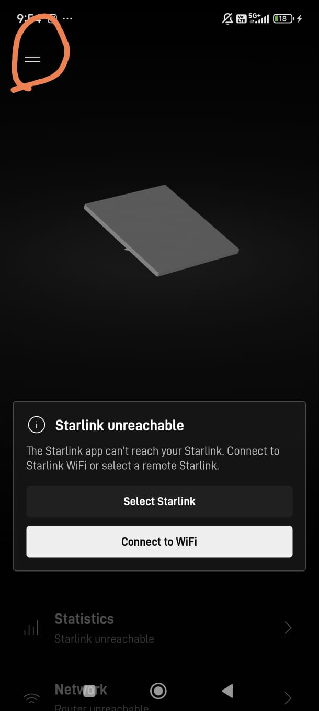
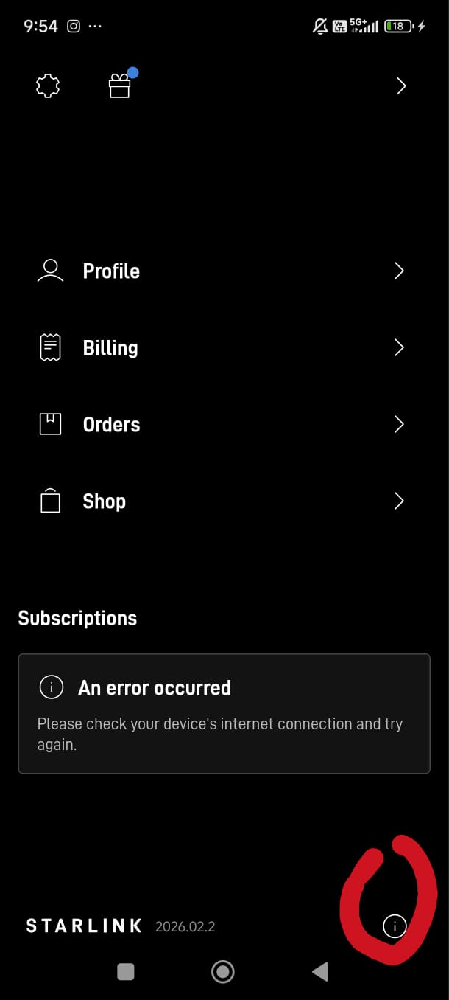
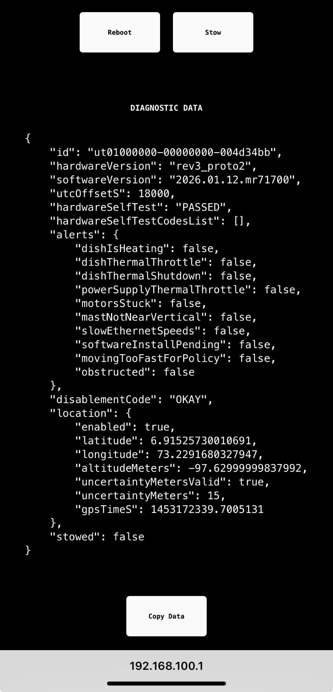

# Starlink Setup

You need to configure Starlink antenna to make its position data available
on the local network
by turning on "allow position access on local network" in the debug data.

Start the Starlink app and go to settings. You may need to press the
two horizontal lines on the top left.

Then press the little information icon in the bottom right of the app

Finally, toggle debug data.

## Test that your changes worked.

Send a brower to 192.168.100.1 and you
should see a data display similar to that below.

Look at the data and confirm there is a "location" section. This confirms
that the Starlink antenna is making location data available on the local
network.